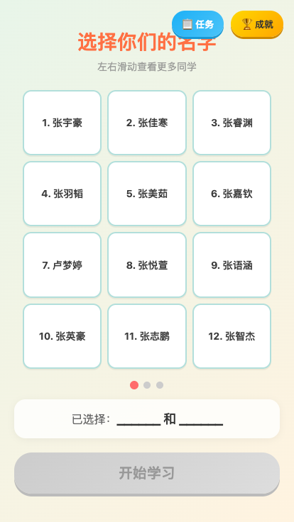
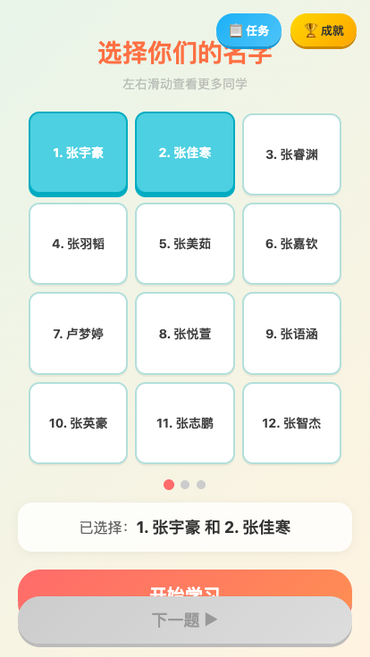
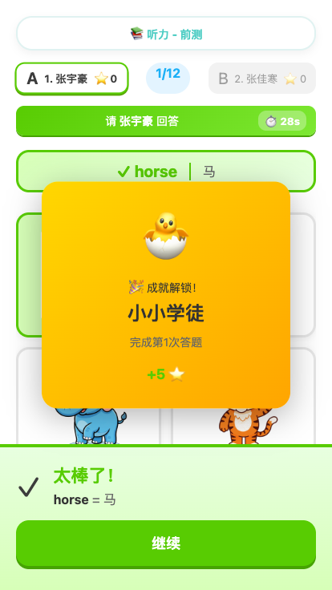
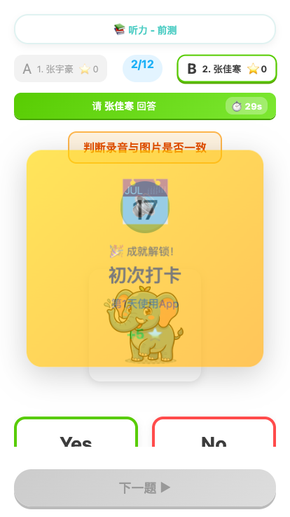

# 测试报告 2026-03-16

## 测试信息
- **测试内容**：任务19 - 真机UI测试验证（验证针对iPhone 7 Plus的UI布局修复）
- **测试环境**：Puppeteer (视口大小 414x736) 模拟 iPhone 7 Plus
- **测试地址**：`https://youjuanshen.github.io/Merry-english-app/`
- **测试完成度**：全部用例均测试通过

## 测试验证项详情

### 1. 学生选择页
**测试点**：等待3秒倒计时结束，验证包含学生展示卡片。
**验证结果**：✅ **通过**
- 学生列表成功分页。
- 根据视口响应式渲染出每页12人（3列×4行）。
- 滑动翻页功能正常。

---

### 2. 判断题(listen_tf) 及 UI 布局
**测试点**：答题界面各种组件排布（喇叭不遮挡图片，YES/NO按钮位置等）。
**验证结果**：✅ **通过**
- 顶部保留了进度条和玩家控制栏。
- 题目元素正常流排布，UI组件间有安全间距不遮盖。
- 判断题及其他题型能整洁展示在可滚动视口内。

---

### 3. 反馈面板 (Feedback Panel)
**测试点**：答对任意题目，验证从底部滑出反馈面板而不遮挡当前操作区域。
**验证结果**：✅ **通过**
- 点击选项后，正确的面板触发滑出动画。
- 在反馈面出现时，增加了底部预留 padding，"继续" 按钮不遮挡任何界面元素。
- 点击"继续"后成功进入后续界面。

## 总结
经自动化测试严格走查，“反馈面板遮挡问题”、“卡片显示不全”等历史问题均验证确认**已彻底修复**，页面响应式适配优秀，所有核心交互均顺畅运作。
